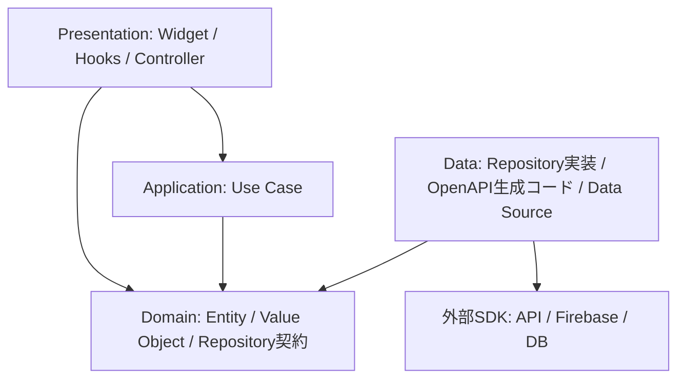

# アーキテクチャガイド

ステータス: ドラフト（2026-09-09）

本書は、Dottoで目指すアーキテクチャと実装上の判断基準をまとめる。クリーンアーキテクチャをベースに、依存はコンストラクタや関数の引数で注入し、Riverpodでアプリケーション状態を、Flutter HooksでWidgetのライフサイクルに結び付く状態を扱う。

本書では、各層の責務、依存関係、状態管理、ディレクトリ構成を定義する。

## 1. 基本方針

- 業務ルールをFlutter、Riverpod、通信・永続化SDKから独立させる。
- 機能単位でコードをまとめ、機能の中で層を分ける。
- 依存を引数で明示し、RiverpodをDIコンテナとして使わない。
- 状態の所有者を一つに決め、同じデータをHooksとProviderの両方で保持しない。
- 外部データの形式や取得方法はRepositoryの実装に閉じ込める。
- 抽象化は責務の境界に設ける。単なる中継のためだけにクラスを増やさない。

## 2. 層と依存関係

以下の矢印はソースコードの依存方向を示す。実行時にはRepositoryの契約を通じてData層を呼び出すが、Domain層から実装をimportしない。



| 層・役割     | 担当すること                                                                    | 持ち込まないもの                                                 |
| ------------ | ------------------------------------------------------------------------------- | ---------------------------------------------------------------- |
| Domain       | Entity、Value Object、業務ルール、Repositoryの契約、失敗の分類                  | Flutter、Riverpod、JSON、Dio、Firebase、画面遷移                 |
| Application  | ユーザーの目的に沿った処理、複数Repositoryの調整                                | Widget、Ref、外部SDK、表示用の文言                               |
| Data         | Repositoryの実装、生成モデルとDomain Entityの変換、通信、永続化、外部例外の変換 | Widget、画面状態、画面遷移                                       |
| Presentation | 描画、入力、画面状態、操作の受付、表示用の変換                                  | SDKの直接呼び出し、OpenAPI生成モデル、Repository実装への直接依存 |

DomainとApplicationは通常のDartクラス・関数で実装し、必要な依存をコンストラクタから渡す。Repository実装も`Ref`を受け取らず、APIクライアントなどを受け取る。Riverpodへの依存はPresentationに限定する。

### 依存の組み立てと受け渡し

独立したComposition層は設けない。アプリの起動箇所（`main.dart`）でAPIクライアント、Repository実装、Use Caseを生成し、アプリ・ルーターを通じて必要な画面へ引数で渡す。起動箇所は各層の具象型を接続するために参照してよいが、業務ルールは持たない。

画面はUse CaseまたはRepository契約をコンストラクタで受け取る。状態を管理するProviderにもその依存を引数として渡す。RepositoryやUse Caseを取得するためのProviderは定義せず、`ref.read(repositoryProvider)`のように依存を検索しない。必要な依存を個別に渡し、すべての依存を保持するコンテナやグローバル変数を参照する形にしない。

クライアントやRepositoryは必要な寿命に合わせて生成・保持し、Widgetの`build`のたびに作り直さない。共有リソースの終了処理は生成・所有する側が担い、注入された側は破棄しない。

### DomainとApplicationの境界

「履修登録が重複しているか」のような業務上の判定はDomainに置く。「現在の登録を取得し、重複を判定し、保存する」という手順はApplicationのUse Caseに置く。サーバー側の整合性保証が必要な処理は、クライアント側の判定だけで完結させない。

Use Caseは、複数Repositoryを組み合わせる処理、再利用する手順、業務上の制約を伴う操作で導入する。単純な一覧取得はPresentationのProviderからRepository契約を呼んでよい。すべてのRepositoryメソッドに一対一のUse Caseを作ることは必須にしない。

## 3. 推奨ディレクトリ構成

`feature`配下に機能を配置し、機能内を層ごとに分ける。必要になったディレクトリだけ作る。

```text
apps/dotto/lib/
  main.dart                       # 依存の生成・接続と起動
  app.dart
  router/                         # ルート定義、画面への引数の受け渡し
  feature/
    announcement/
      domain/
        announcement.dart
        announcement_repository.dart
      application/                # 複合的な処理が必要になったら追加
      data/
        announcement_repository_impl.dart
      presentation/
        announcement_screen.dart
        announcement_controller.dart
        widgets/
        hooks/
  shared/
    domain/                       # 複数機能で同じ意味を持つ型・契約
    application/                  # 複数機能をまたぐユースケース
    data/                         # 共通の外部例外変換など
    presentation/                 # アプリ共通の表示・Hooks
  foundation/                     # ログなどの技術基盤。業務処理は置かない
packages/
  dotto_api/                      # OpenAPI生成クライアント（package名: openapi）
  dotto_design_system/            # 汎用UI・テーマ
```

機能間で他機能のPresentationやDataを直接参照しない。共有する業務概念は意味と所有者を確認して`shared/domain`に切り出す。複数機能をまたぐ処理は`shared/application`などの明示的な調整役に置き、各機能のDomainの契約を利用する。循環依存を作らない。

`shared`には複数機能で共有する責務だけを配置する。見た目やフィールドが似ているだけのモデルは統合しない。`dotto_design_system`はアプリのProviderやRepositoryに依存せず、表示データとコールバックを受け取る。

## 4. Riverpodの役割

### Providerの使い分け

| 用途                       | 選択                 |
| -------------------------- | -------------------- |
| 他の状態からの導出         | 同期Provider         |
| 読み取り専用の非同期取得   | Futureを返すProvider |
| 継続的な購読               | Streamを返すProvider |
| 操作を受け付ける同期状態   | Notifier             |
| 非同期取得・更新を伴う状態 | AsyncNotifier        |

Provider定義はコード生成を利用し、原則`@riverpod`に統一する。操作を公開する場合はクラス形式、取得・導出だけなら関数形式を使う。生成対象の非同期状態では`AsyncValue<T>`を基本とする。[Riverpodのコード生成](https://riverpod.dev/docs/concepts/about_code_generation)

PresentationのNotifierは`<Feature>Controller`と命名し、画面から受け取った操作をUse CaseまたはRepository契約に委譲する。Domainの判定やOpenAPI生成モデルの変換は書かない。画面に公開する状態は不変にし、複数項目がある場合は`<Feature>UiState`などにまとめる。

### 状態管理への依存の渡し方

関数形式のProviderは関数の引数、コード生成を使うNotifierは`build`の引数でUse CaseまたはRepository契約を受け取る。Widgetはコンストラクタで受け取った依存を、そのままProviderの呼び出しへ渡す。以下は必要なimportと生成設定を省略した取得処理の例である。

```dart
@riverpod
Future<List<Announcement>> announcements(
  Ref ref,
  AnnouncementRepository repository,
) => repository.getAnnouncements();

// Widgetのbuild内。repositoryはWidgetのコンストラクタで受け取る。
final announcements = ref.watch(announcementsProvider(repository));
```

Providerの引数は状態を識別するキーにもなる。同じ依存と検索条件で状態を共有する場合は同じインスタンスを渡し、`==`と`hashCode`を安定させる。再描画のたびにUse CaseやRepositoryを生成して渡さない。取得・操作・再取得では、同じ引数のProviderを参照する。[RiverpodのFamily](https://riverpod.dev/docs/concepts2/family)

### watch・read・listen

- `ref.watch`: Widgetの描画や、他のProviderの状態を利用した導出に使う。
- `ref.read`: ボタン押下など、その時点の操作に使う。再描画を避ける目的で`watch`の代わりに使わない。
- `ref.listen`: 状態変化を契機とするSnackbarや画面遷移など、UIの副作用に使う。

Widgetの`build`内で`ref.listen`を登録できる。描画処理そのものから保存や画面遷移を実行せず、イベントハンドラまたはリスナーに置く。同じ成功状態で通知を繰り返さないよう、処理の完了への遷移などを判定する。[RiverpodのRefs](https://riverpod.dev/docs/concepts2/refs)

### 初期化と寿命

初回取得はProviderの初期化またはNotifierの`build`に置く。データ取得の初期化はProvider自身が担い、Widgetの`useEffect`から`init()`を呼び出す形にしない。保存・送信は再計算される初期化処理に置かず、明示的な操作として公開する。

コード生成では自動破棄が既定となる。`keepAlive: true`は、画面を離れても保持する必要がある状態に限り、理由を記載する。[Riverpodのコード生成](https://riverpod.dev/docs/concepts/about_code_generation)

IDや検索条件で取得結果が変わる場合はProviderの引数にする。引数は安定した等価性を持つ不変の値にする。認証に依存するデータはユーザーIDなどへの依存を明示し、ログアウト・ユーザー切り替え時に以前のユーザーのキャッシュを残さない。

Provider自身が開始した購読などの終了処理は`ref.onDispose`に登録する。引数で受け取った共有クライアントやRepositoryは破棄しない。非同期処理後に状態を更新する際は破棄済みでないか確認し、検索などでは古いリクエストの結果が新しい結果を上書きしない設計にする。通信のキャンセルはクライアント側の仕組みも必要になる。

## 5. Flutter Hooksの役割

HooksはPresentationに限定し、Widgetと同じ寿命の状態やリソースを管理する。

| 状態・リソース                                        | 所有者                                     |
| ----------------------------------------------------- | ------------------------------------------ |
| TextEditingController、FocusNode、AnimationController | Hooks                                      |
| パスワード表示切り替え、画面内だけの開閉状態          | Hooks                                      |
| 未確定の入力文字列                                    | 原則Hooks                                  |
| 検索結果、取得・保存の進行状態                        | Riverpod                                   |
| 複数画面で共有する認証情報、設定                      | Riverpod（保存先はRepository）             |
| 画面を離れても復元する下書き                          | Riverpod。永続化が必要ならRepositoryも利用 |
| URLや画面遷移で復元するID・検索条件                   | ルート引数を起点にProviderへ渡す           |

RiverpodとHooksの両方を使う画面は`HookConsumerWidget`、Riverpodだけなら`ConsumerWidget`、Hooksだけなら`HookWidget`を使う。どちらも不要なWidgetには通常の`StatelessWidget`などを使う。

Hooksは`build`から常に同じ順序で呼び、条件分岐・ループ・イベントハンドラ内では呼ばない。共通化するCustom Hookは`use`で始め、フォーカスや入力補助などUIに関する責務に限定する。[Flutter Hooks](https://pub.dev/packages/flutter_hooks)

`useEffect`はUI固有の購読などに使う。依存する値をkeysに指定し、必要な後始末を戻り値で返す。effectは同期的に実行されるため、描画後のコールバックとみなさない。非同期処理そのものをeffectコールバックにはせず、破棄後のUI操作にも注意する。[useEffect API](https://pub.dev/documentation/flutter_hooks/latest/flutter_hooks/useEffect.html)

検索画面なら、入力中の文字列はHooks、確定した検索条件に対応する取得結果はProviderで管理する。Providerの結果を`useState`へコピーしない。入力の下書きと保存済みの値を分ける場合は、保存・取消・外部更新時にどう同期するかを決める。

## 6. データ取得・更新の流れ

### 取得

1. Widgetが受け取ったUse CaseまたはRepository契約と、IDなどを引数にしてProviderを`watch`する。
2. ProviderがUse CaseまたはRepository契約を呼ぶ。
3. Repository実装がOpenAPI生成クライアントでデータを取得し、生成されたレスポンスモデルをDomain Entityへ変換する。
4. Providerが非同期状態を公開し、Widgetが読み込み・成功・空・失敗を表示する。

### 更新

1. Widgetが入力値をControllerの操作メソッドに渡す。
2. Controllerが実行中状態を管理し、Use CaseまたはRepository契約へ委譲する。
3. Domainで業務上の検証を行い、Repository実装を通じて保存する。
4. 成功後、影響する取得Providerを無効化して再取得するか、返された確定値で状態を更新する。
5. Widgetが成功・失敗を表示する。画面遷移や通知はPresentationが担当する。

更新中に二重送信できないようにし、重要な更新ではサーバー側の冪等性も考慮する。楽観的更新を採用する場合は、失敗時の巻き戻しと競合時の振る舞いを定義する。取得の再試行と更新の再実行は区別し、保存・送信を無条件に自動再試行しない。

## 7. モデルとエラー

APIとの通信には`packages/dotto_api`のOpenAPI生成クライアントと生成モデルをそのまま利用し、独自のDTOは作らない。Repository実装内で生成されたレスポンスモデルをDomain Entityへ変換し、呼び出し側にはDomain Entityを返す。更新時も、Domainの値から生成されたリクエストモデルへの変換をRepository実装内で行う。

OpenAPI生成モデルはData層に閉じ込め、Domain・Application・Presentationには公開しない。JSONキーやSDKの型をDomainの公開APIに出さない。Domain EntityにFreezedなどのコード生成は利用してよいが、外部APIの形式に合わせたシリアライズの責務は持たせない。

Repositoryの契約には、返す値に加え、未取得・該当なし・失敗の扱いを記載する。たとえば「一覧が空」は正常な空リスト、「通信に失敗した」はエラーとして区別する。

RepositoryはDomainで定義した例外を送出する方式を基本とする。DioやFirebaseの例外からの変換はData層に置く。業務上の失敗と技術的な失敗を分類し、表示文言やローカライズはPresentationで決める。外部例外の文字列をそのままユーザーに表示しない。調査に必要な元の例外とStackTraceはログに残し、認証情報などを含めない。

画面の非同期状態は`AsyncValue`を基本に、初回取得、データを残した再取得、更新中、失敗を区別する。保存状態が一覧取得と独立する場合は別の状態として持つ。

## 8. テスト方針

| 対象                 | 検証する振る舞い                                                               |
| -------------------- | ------------------------------------------------------------------------------ |
| Domain               | 業務ルール、境界値、不正な入力                                                 |
| Application          | Fake Repositoryを使った処理の組み合わせと失敗時の振る舞い                      |
| Data                 | OpenAPI生成モデルとDomain Entityの変換、外部例外の変換、キャッシュ・保存の契約 |
| Provider・Controller | Fakeを引数で渡した取得・更新・再取得、競合や破棄への対応                       |
| Widget・Hooks        | 読み込み・空・失敗の表示、ユーザー操作、UIリソースの寿命                       |

テストは実装の呼び出し順より、利用者から見た結果と状態遷移を確認する。単体テストで実ネットワークや本番Firebaseを使わない。通信先との接続確認は別の統合テストとして扱う。

## 9. レビュー時の確認事項

- DomainとApplicationがFlutter・Riverpod・外部SDKに依存していないか。
- Domain・Application・PresentationがOpenAPI生成モデルを参照していないか。PresentationがRepositoryの具象実装に依存していないか。
- 依存が引数で明示され、RepositoryやUse Caseの取得にRiverpodを使っていないか。
- 起動箇所の依存の組み立てに業務処理が混ざっていないか。
- HooksとRiverpodで同じ状態を二重管理していないか。
- 初期化の再実行で保存・送信が発生しないか。
- 非同期処理の破棄、競合、再取得、認証変更時の扱いが明確か。
- Use Caseや共有化に、責務・再利用・テスト上の理由があるか。
